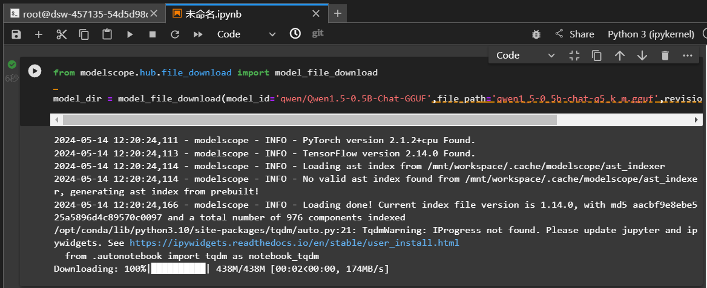
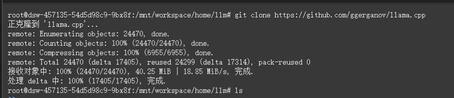
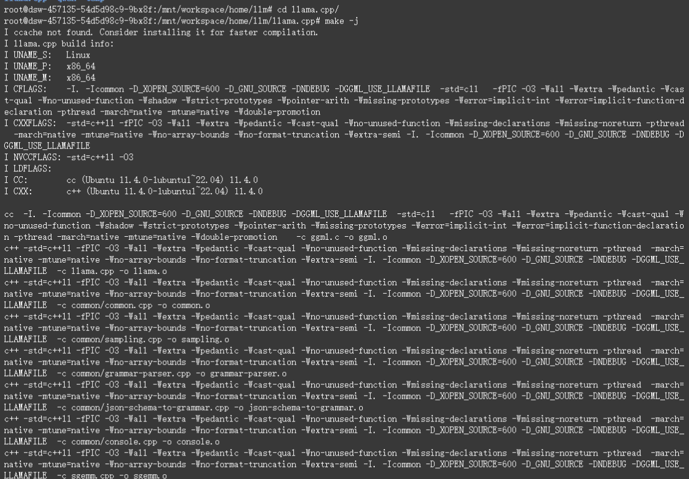
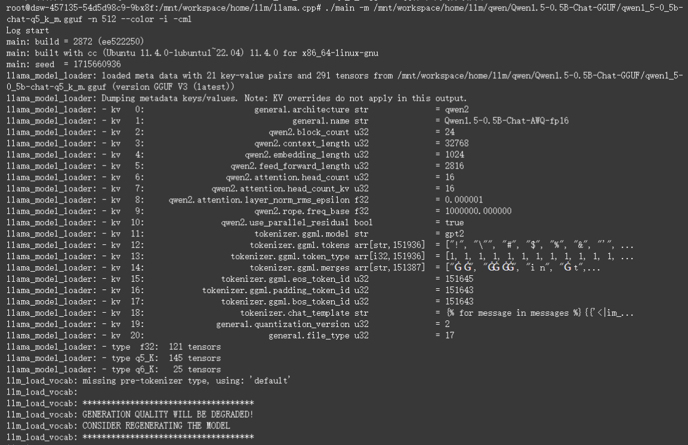
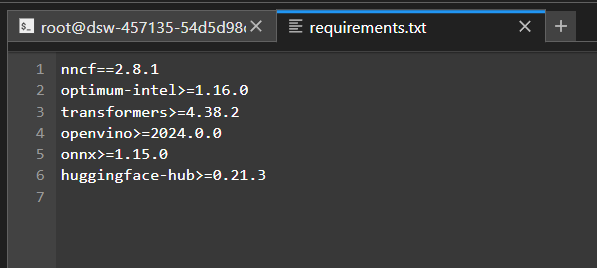
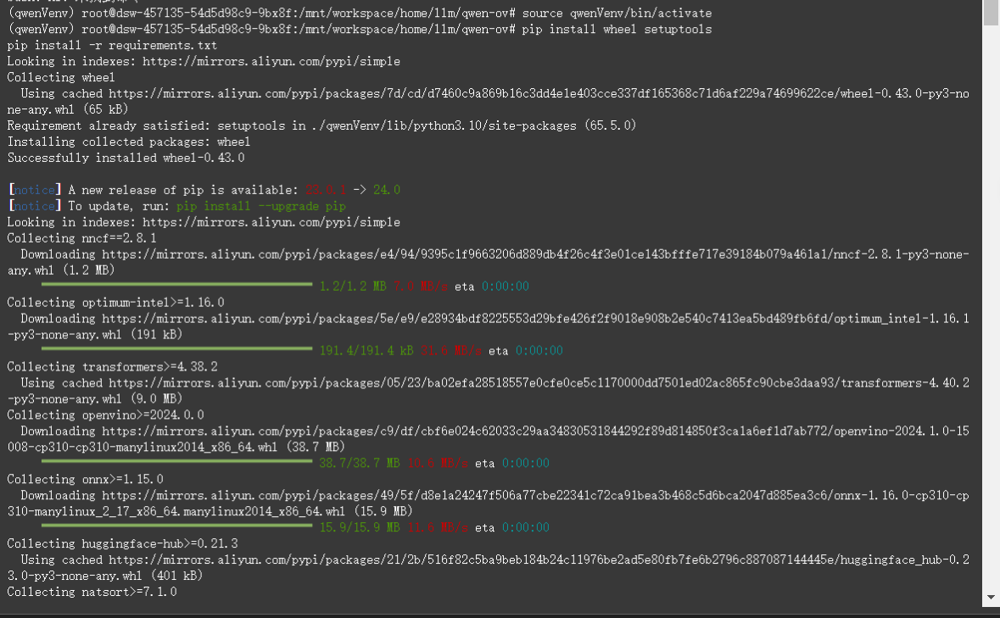
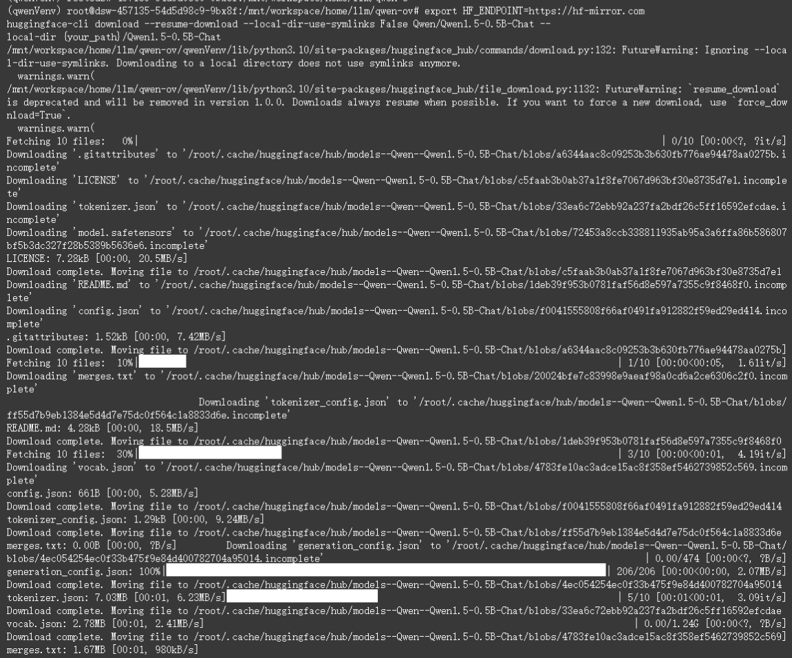
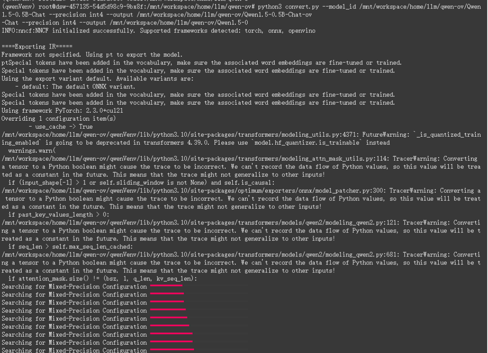
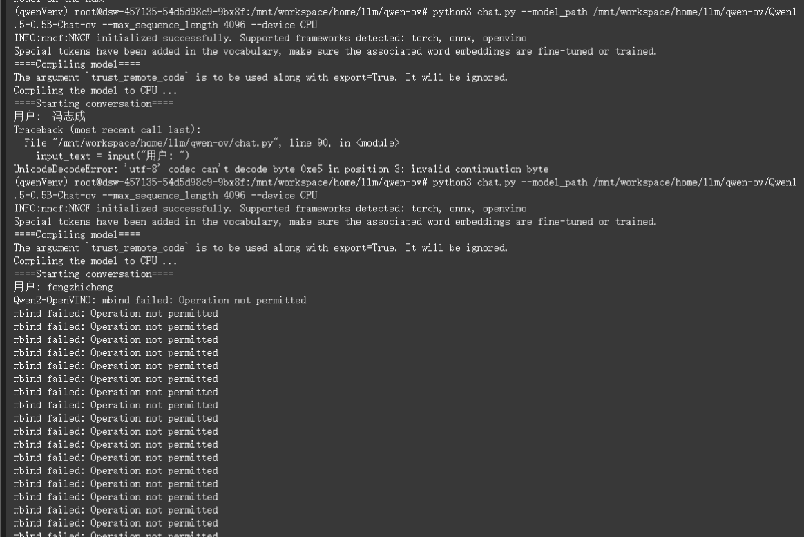
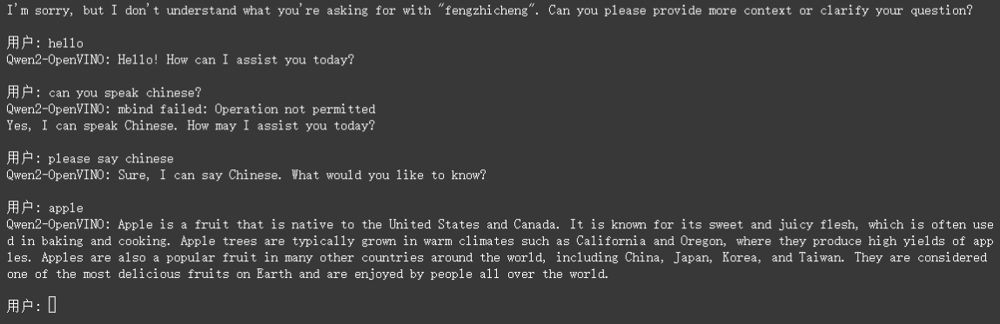

# LLM实验一：大模型部署，qwen1.5-0.5b

------


### 一、Qwen1.5-0.5B-Chat-GGUF 模型部署

##### 1.使用download_model.py文件下载代码

```python
from modelscope.hub.file_download import model_file_download

model_dir = model_file_download(model_id='qwen/Qwen1.5-0.5B-ChatGGUF',file_path='qwen1_5-0_5b-chat
q5_k_m.gguf',revision='master',cache_dir='path/to/local/dir')
```



##### 2.下载llama.cpp

```
git clone https://github.com/ggerganov/llama.cpp
```



编译llama.cpp项⽬



```
cd llama.cpp
make -j
```

##### 3.加载模型并执行



```
./main -m /mnt/workspace/home/llm/qwen/Qwen1.5-0.5B-Chat-GGUF/qwen1_5-0_5b-chatq5_k_m.gguf -n 512 --color -i -cml
```

------

### 二、Qwen2.openvino 模型部署

##### 1.创建⽬录qwen-ov&&创建Python虚拟环境&&安装依赖的包



```
python -m venv qwenVenv
source qwenVenv/bin/activate

pip install wheel setuptools
pip install -r requirements.txt
```



##### 2.下载模型

```
export HF_ENDPOINT=https://hf-mirror.com
huggingface-cli download --resume-download --local-dir-use-symlinks False Qwen/Qwen1.5-0.5B-Chat --
local-dir /mnt/workspace/home/llm/qwen-ov/Qwen1.5-0.5B-Chat
```



##### 3.转换模型

```
python3 convert.py --model_id /mnt/workspace/home/llm/qwen-ov/Qwen/Qwen1.5-0.5B-Chat --precision int4 --output /mnt/workspace/home/llm/qwen-ov/Qwen1.5-0.5B-Chat-ov
```



##### 4.加载模型并执行

```
python3 chat.py --model_path /mnt/workspace/home/llm/qwen-ov/Qwen1.5-0.5B-Chat-ov --max_sequence_length 4096 --device CPU
```



##### 5.模型对话测试

